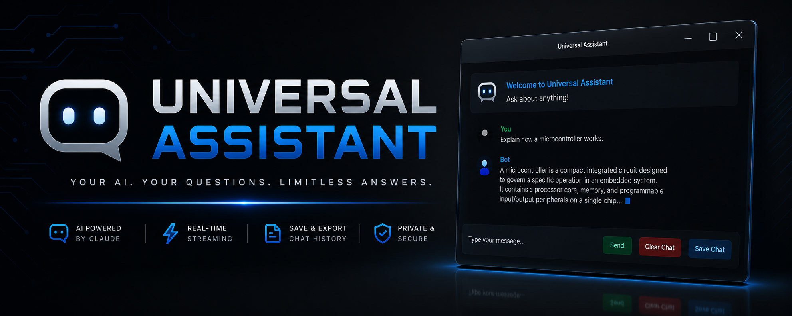
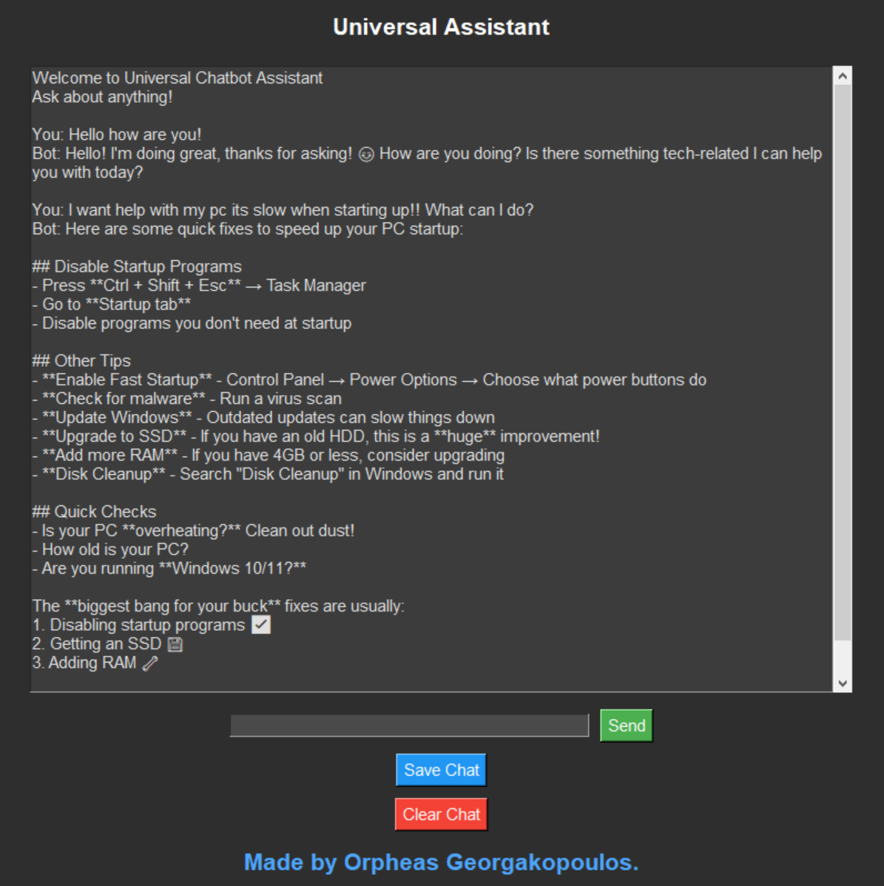

# 🤖 Universal Assistant

<div align="center">




**A modern desktop AI assistant powered by Claude and built with Python.**

Fast. Lightweight. Responsive.

</div>

---

## ✨ Features

* ⚡ Real-time streaming AI responses
* 🖥️ Clean desktop interface built with Tkinter
* 🧠 Powered by Anthropic Claude
* 💬 Persistent conversation context
* 📄 Export chat history to Markdown (`.md`)
* 🚀 Multi-threaded architecture for smooth performance
* 🎯 Customizable assistant personality via system prompts
* 🔗 Direct GitHub profile integration

---

## 📸 Preview



---

## 🛠️ Requirements

* Python 3.10+
* Anthropic API Key
* Internet connection

---

## 📦 Installation

Clone the repository:

```bash
git clone https://github.com/OrpheasGeorgakopoulos/Universal-Assistant.git
cd Universal-Assistant
```

Install dependencies:

```bash
pip install anthropic
```

Configure your API key:

### Windows (PowerShell)

```powershell
$env:ANTHROPIC_API_KEY="your_api_key_here"
```

### Linux / macOS

```bash
export ANTHROPIC_API_KEY="your_api_key_here"
```

---

## 🚀 Launch

```bash
python main.py
```

---

## ⚙️ Configuration

Customize the assistant's behavior by editing:

```python
SYSTEM_PROMPT = "You are a friendly and helpful assistant..."
```

Examples:

* 👨‍💻 Programming Assistant
* 🔧 Electronics Expert
* 📚 Learning Tutor
* 🤝 Customer Support Agent
* 🏋️ Personal Coach
* 🧪 Technical Research Assistant

---

## 🏗️ Project Structure

```text
.
├── main.py
├── img_preview.png
├── README.md
└── requirements.txt
```

---

## 🔧 Built With

| Technology    | Purpose                         |
| ------------- | ------------------------------- |
| Python        | Core application                |
| Tkinter       | Desktop UI                      |
| Anthropic API | AI inference                    |
| Threading     | Non-blocking response streaming |

---

## 📄 Chat Export

Conversations can be exported directly to Markdown files:

```text
chat_history.md
```

Perfect for:

* Documentation
* Research notes
* Project logs
* Knowledge archiving

---

## 🔒 Security

* API keys are never hardcoded
* Credentials are loaded from environment variables
* No local storage of sensitive data
* Direct communication with Anthropic services

---

## 👨‍💻 Author

**Orpheas Georgakopoulos**

GitHub: https://github.com/OrpheasGeorgakopoulos

---

<div align="center">

⭐ If you find this project useful, consider starring the repository.

Built with Python, Claude, and a lot of coffee ☕

</div>
